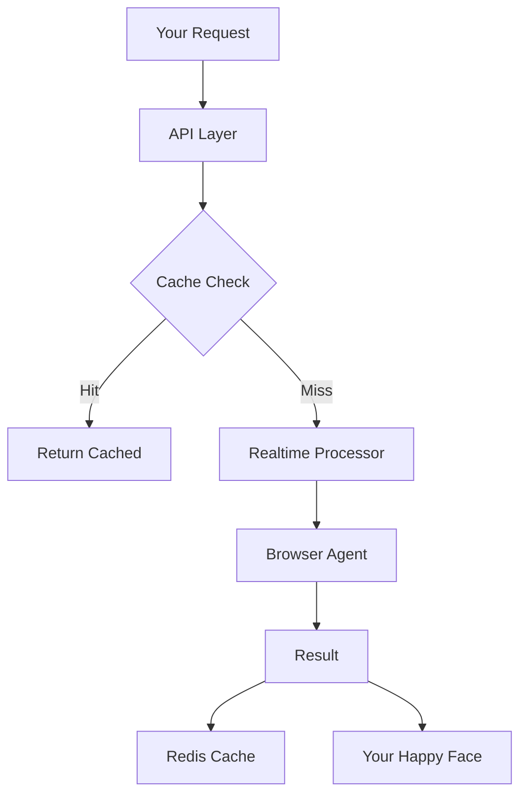

# 🤖 HuggingScrape - Because Life's Too Short for Manual Scraping

Need web data but tired of wrestling with XPaths and CSS selectors? HuggingScrape is your AI-powered web scraping butler! Just tell it what you want in plain English, sit back, and watch the magic happen. No PhD in DOM manipulation required! 

## 🌟 Features That Make Data Engineers Smile

- 🧠 **AI-Powered Scraping**: Like having a tiny data scientist in your browser
- 🎯 **Natural Language Tasks**: Because life's too short for regex
- 🎬 **Visual Task Recording**: Watch your robot assistant do the boring stuff
- 💾 **Smart Caching**: We remember stuff so you don't have to
- 🎨 **User-Friendly Interface**: So pretty, it belongs in a UI museum

## 🔧 Environment Setup (The "Please Don't Break Anything" Part)

Create a `.env` file in your project root (promise we won't tell anyone your API keys):

```env
ANTHROPIC_API_KEY=your_claude_api_key    # Required if using Anthropic models
OPENAI_API_KEY=your_openai_api_key       # Required if using OpenAI models
GOOGLE_API_KEY=your_google_api_key       # Required if using Google models
REDIS_URL=redis://your.redis.host:6379
PORT=3000                                # Optional, defaults to 3000
```

## 🐳 Docker Setup (A.K.A. "Works on My Machine" Insurance)

1. Build the image (grab a coffee, this might take a minute):
```bash
docker build -t huggingscrape .
```

2. Run it like you mean it:
```bash
docker run -p 3000:3000 \
  --env-file .env \
  -v $(pwd)/data:/app/data \
  huggingscrape
```

3. Useful Docker commands (for when things inevitably go wrong):
```bash
# View logs
docker logs huggingscrape

# Stop container
docker stop huggingscrape

# Remove container
docker rm huggingscrape

# Rebuild and restart (development)
docker compose up --build
```

## 🎯 Usage Example (The "Even Your Cat Could Do It" Guide)

1. Point your favorite browser to `http://localhost:3000`
2. Feed it your API keys (we promise to treat them like crown jewels)
3. Tell it what you want, like you're ordering at a drive-through:
   "Find me all the cat memes on reddit... I mean, product prices on Amazon"
4. Hit that big shiny button and watch your digital minion go to work
5. Collect your data and pretend you spent hours doing it manually

## 🚀 API (For the "I'm Too Cool for UIs" Crowd)

Our API is like a drive-through for web scraping - just throw your requests at it and watch the magic happen!

### 🎯 Endpoints That Actually Work

```bash
# The main event - POST /task
curl -X POST http://localhost:3000/task \
  -H "Content-Type: application/json" \
  -d '{
    "task": "Find me the meaning of life... or just scrape some prices",
    "postback_url": "http://optional-webhook.com/results"
  }'
```

### 🎭 Response (What You Actually Get)

```json
{
  "status": "success",
  "data": {
    "result": "Your data, served fresh!",
    "cached": false,
    "postback_error": "Only shows up if your webhook is having a bad day"
  }
}
```

### 🎪 Features That Make APIs Fun Again

- 🧠 **Smart Caching**: Because nobody likes waiting twice for the same thing
- 🎯 **Webhook Support**: For when you're too busy to keep hitting refresh
- 🛡️ **Error Handling**: Actually tells you what went wrong (in plain English!)
- 📊 **Redis Integration**: Because RAM isn't infinite (yet)

## ⚡ Realtime Magic (The "I Need It Yesterday" Edition)

Our realtime system is like having a caffeinated intern who never sleeps (but actually knows what they're doing).

### 🎪 What's Under The Hood

```bash
# Start the realtime processor
python realtime.py

# Watch your terminal turn into a Matrix-style data stream
# (but actually useful)
```

### 🎭 Features That Make It Special

- 🔄 **Live Updates**: See results faster than you can say "web scraping"
- 📡 **Ably Integration**: Because WebSockets are so 2020
- 🎥 **Live Recording**: Watch your scraping happen in real-time
- 🧯 **Auto-Recovery**: Like a cat, it always lands on its feet

### 🎪 Channel Structure

```javascript
// Subscribe to these channels to feel like a tech wizard
browser-result: "Where the magic happens"
browser-error: "When things go sideways"
browser-status: "Is it coffee break time?"
```

## 📝 Logging (For When Things Go South)

Set `LOG_LEVEL` to your preferred flavor of panic:
- DEBUG: For when you need to know EVERYTHING
- INFO: For normal people
- WARNING: For optimists
- ERROR: For when things get spicy
- CRITICAL: Time to update your resume

Remember: If all else fails, try turning it off and on again! 🔌✨

## 🏗️ Architecture (The "How It Actually Works" Bit)


